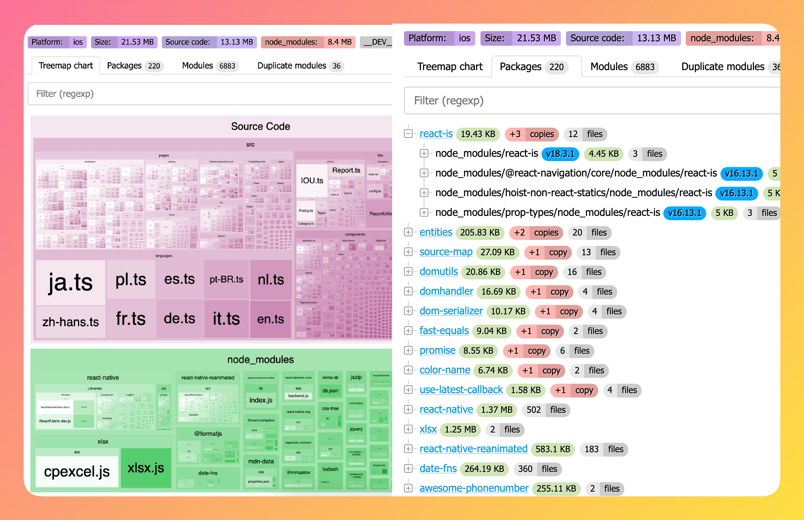

# react-native-bundle-discovery

> [!WARNING]
> Currently, everything is in a very early stage. The project is not yet ready for use.


A simple package that helps developers visualize and analyze the bundle size of React Native apps.
With this tool, you can easily explore your app's codebase, identify large or heavy packages, and inspect the structure of modules and code within your project.



### Setup:

#### 1. Install
```bash
yarn add -D react-native-bundle-discovery
```

#### 2. Add to your metro.config.js

```diff
// metro.config.js
const {getDefaultConfig, mergeConfig} = require('@react-native/metro-config');
+const {createSerializer} = require('react-native-bundle-discovery');

+const mySerializer = createSerializer({  
+  includeCode: true, // Useful if you want to compare source/bundle code (but a report file will be larger)
+  projectRoot: __dirname, 
+   //^^^ ⚠️ WARNING: In a monorepo setup, this should point to the monorepo root,
+   //                not the individual package directory.
+});

-const config = {};
+const config = {
+  serializer: {
+    customSerializer: mySerializer
+  },
+};

module.exports = mergeConfig(getDefaultConfig(__dirname), config);
```

#### 3. Build the app

As example, for iOS you can run the following command, and it will generate the `metro-stats.json` file in the root of your project:

```bash
npx react-native bundle \
  --entry-file index.js \
  --platform ios \
  --dev false \
  --bundle-output ios/main.jsbundle \
  --assets-dest ios/assets
```

#### 4. View the report

Run webserver to view the report:

```bash
npx react-native-bundle-discovery metro-stats.json
```

---

**Similar projects:**

- https://github.com/expo/atlas
- https://github.com/v3ron/expo-atlas-without-expo
- https://github.com/callstack/react-native-bundle-visualizer
- https://github.com/webpack-contrib/webpack-bundle-analyzer
- https://github.com/statoscope/statoscope
- https://github.com/relative-ci/bundle-stats/tree/master/packages/cli

--- 

**Built using Discovery.js:**
- Build blocks for pages: https://discoveryjs.github.io/discovery/#views-showcase
- Jora syntax: https://discoveryjs.github.io/jora/#article:jora-syntax-operators

---

### Financial Contributors

Become a financial contributor at [OpenCollective](https://opencollective.com/react-native-bundle-discovery) or [GitHub Sponsors](https://github.com/sponsors/retyui)

