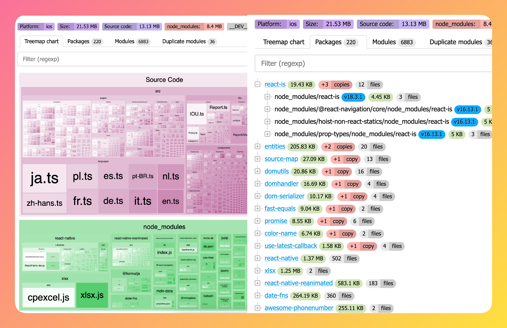

# react-native-bundle-discovery

[](https://www.npmjs.com/package/react-native-bundle-discovery)
[](https://www.npmtrends.com/react-native-bundle-discovery)


A simple package that helps developers visualize and analyze the bundle size of React Native apps.
With this tool, you can easily explore your app's codebase, identify large or heavy packages, and inspect the structure of modules and code within your project.




### Packages:

- `react-native-bundle-discovery` - simple JS library to generate a JSON report of the bundle.
- `react-native-bundle-discovery-ui` - UI to visualize the bundle report.
- `react-native-bundle-discovery-cli` - CLI to analyze the bundle report.
- `react-native-bundle-discovery-rozenite-plugin` - Rozenite plugin to integrate UI tool to [React Native DevTools](https://reactnative.dev/docs/react-native-devtools).

### Setup:

There are two ways to install the package:

1. As in independent tool (UI + CLI) 
2. Or as a [Rozenite](_rozenite/README.md) plugin (see: [_rozenite/README.md](_rozenite/README.md))

#### 1. Install (independent tool)

```bash
yarn add -D react-native-bundle-discovery # required for generating the JSON report
yarn add -D react-native-bundle-discovery-ui # optional: used for visualizing the report in the browser
yarn add -D react-native-bundle-discovery-cli # optional: used for analysis of the report in the CLI
```

Add to your `metro.config.js`:

```diff
// metro.config.js
const {getDefaultConfig, mergeConfig} = require('@react-native/metro-config');
+const {createSerializer} = require('react-native-bundle-discovery');

+const mySerializer = createSerializer({
+  includeCode: true, // Useful if you want to compare source/bundle code (but a report file will be larger)
+  projectRoot: __dirname,
+   //^^^ ⚠️ WARNING: In a monorepo setup, this should point to the monorepo root,
+   //                not the individual package directory.
+});

-const config = {};
+const config = {
  serializer: { customSerializer: mySerializer },
};

module.exports = mergeConfig(getDefaultConfig(__dirname), config);
```

#### 2. Install (as plugin for Rozenite)

See: [_rozenite/README.md](_rozenite/README.md)

---

### 3. Build the app

As example, for iOS you can run the following command, and it will generate the `metro-stats.json` file in the root of your project:

```bash
npx react-native bundle \
  --entry-file index.js \
  --platform ios \
  --dev false \
  --bundle-output ios/main.jsbundle \
  --assets-dest ios/assets
```

### 4. Commands

#### CLI package

You need to install `react-native-bundle-discovery-cli`

```bash
# Display all recommended optimizations for the bundle
npx react-native-bundle-discovery-cli metro-stats.json

# Display all packages in the bundle report
npx react-native-bundle-discovery-cli packages metro-stats.json [--sort size|name] [--format json|table|default]
```

#### UI package

You need to install `react-native-bundle-discovery-ui`

```bash
# Start server to view the report in the browser (default port: 8079)
npx react-native-bundle-discovery-ui metro-stats.json [--port <port>]

# Build the report into a static HTML file
npx react-native-bundle-discovery-ui build metro-stats.json
```

---

### `react-native-bundle-discovery` JS API

#### `createSerializer(options: Options)`

| Prop                   | Default value             | Description                                                                                                                              |
| ---------------------- | ------------------------- | ---------------------------------------------------------------------------------------------------------------------------------------- |
| serializer: Function   | Default serializer        | A custom serializer function. If not provided, a default serializer is used.                                                             |
| projectRoot: string    | Required                  | The root directory of the project. ⚠️ In a monorepo setup, this should point to the monorepo root, not the individual package directory. |
| outputJsonPath: string | `<root>/metro-stats.json` | The path where the JSON report will be saved. Defaults to `metro-stats.json` in project root.                                            |
| includeCode: boolean   | `true`                    | Whether to include the source and output code in the JSON report.                                                                        |

### `createProcessModuleFilter(options: ProcessModuleFilterOptions)`


| Prop                   | Default value             | Description                   |
| ---------------------- | ------------------------- | ----------------------------- |
| removePromisePolyfill: boolean | `false` | Remove the Promise polyfill as Hermes provide own impl. (issue: [#57702](https://github.com/react/react-native/issues/57702)) |
| removeOldRenderer: boolean     | `false` | Whether to remove the old renderer. Set to `true` when New Arch is enabled    |
| removeNewRenderer: boolean     | `false` | Whether to remove the new renderer. Set to `true` when New Arch is disabled    |
| removeUTFSequence: boolean     | `false` | Remove useless undocumented RN module.     |


Simple helper that devs can use to filter out unnecessary modules from the bundle report.
You can get recommendations during the analysis of the bundle report using the CLI tool.

```js
// metro.config.js
const {createProcessModuleFilter} = require('react-native-bundle-discovery');
const config = {
  serializer: {
    processModuleFilter: createProcessModuleFilter({
      removePromisePolyfill: true,
      removeOldRenderer: true,
      removeUTFSequence: true,
    }),
  },
};
```

### Financial Contributors

Become a financial contributor at [OpenCollective](https://opencollective.com/react-native-bundle-discovery) or [GitHub Sponsors](https://github.com/sponsors/retyui)

### Other

**Similar projects:**

- [expo-atlas](https://github.com/expo/atlas) [](https://www.npmtrends.com/expo-atlas) [](https://packagephobia.com/result?p=expo-atlas)
- [expo-atlas-without-expo](https://github.com/v3ron/expo-atlas-without-expo) [](https://www.npmtrends.com/expo-atlas-without-expo) [](https://packagephobia.com/result?p=expo-atlas-without-expo)
- [react-native-bundle-visualizer](https://github.com/callstack/react-native-bundle-visualizer) [](https://www.npmtrends.com/react-native-bundle-visualizer)[](https://packagephobia.com/result?p=react-native-bundle-visualizer)
- [webpack-bundle-analyzer](https://github.com/webpack-contrib/webpack-bundle-analyzer) [](https://www.npmtrends.com/webpack-bundle-analyzer)[](https://packagephobia.com/result?p=webpack-bundle-analyzer)
- [bundle-stats](https://github.com/relative-ci/bundle-stats/tree/master/packages/cli#readme) [](https://www.npmtrends.com/bundle-stats)[](https://packagephobia.com/result?p=bundle-stats)
- [statoscope](https://github.com/statoscope/statoscope) [](https://www.npmtrends.com/@statoscope/cli)[](https://packagephobia.com/result?p=@statoscope/cli)

**Built using [Discovery.js](https://github.com/discoveryjs/discovery):**

- Build blocks for pages: https://discoveryjs.github.io/discovery/#views-showcase
- Jora syntax: https://discoveryjs.github.io/jora/#article:jora-syntax-operators
