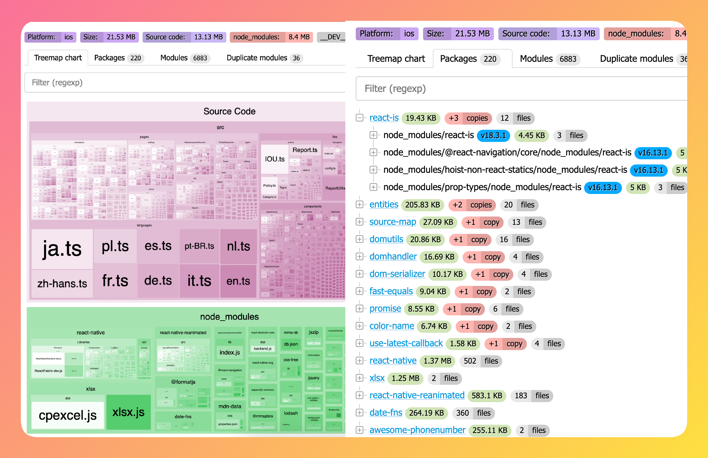

# react-native-bundle-discovery

[](https://www.npmjs.com/package/react-native-bundle-discovery)
[](https://www.npmtrends.com/react-native-bundle-discovery)
[](https://www.npmjs.com/package/react-native-bundle-discovery)

Visualize and analyze the JS bundle of your React Native app. Find heavy packages, duplicates and deprecated
dependencies, inspect every module, and catch bundle size regressions in CI.



## Contents

- [Features](#features)
- [Packages](#packages)
- [Quick start](#quick-start)
- [Other setups](#other-setups)
- [Usage](#usage)
  - [UI](#ui)
  - [CLI](#cli)
  - [Bundle size checks in CI](#bundle-size-checks-in-ci)
- [API](#api)
  - [`createSerializer`](#createserializeroptions)
  - [`createResolveRequest`](#createresolverequestoptions)
- [Similar projects](#similar-projects)
- [Support the project](#support-the-project)
- [License](#license)

## Features

- 📊 Interactive UI to explore packages, modules and their source/bundled code
- 💡 Optimization recommendations (duplicates, deprecated / outdated / dev-only packages, and more)
- 🔍 CLI to list the heaviest packages and modules
- 🆚 Compare two reports and fail CI on bundle size regressions
- 🧩 Works with Metro, [Re.Pack](./Re.Pack.md) and [React Native DevTools](./packages/rozenite-plugin/README.md) (via Rozenite)

## Packages

| Package                                                                  | What it does                                                                                    | Required |
| ------------------------------------------------------------------------ | ----------------------------------------------------------------------------------------------- | -------- |
| `react-native-bundle-discovery`                                          | Generates a JSON report (`metro-stats.json`) of your bundle                                     | ✅ Yes   |
| `react-native-bundle-discovery-ui`                                       | Shows the report in the browser                                                                 | Optional |
| `react-native-bundle-discovery-cli`                                      | Analyzes and compares reports in the terminal / CI                                              | Optional |
| [`react-native-bundle-discovery-rozenite-plugin`](./packages/rozenite-plugin/README.md) | Shows the UI inside [React Native DevTools](https://reactnative.dev/docs/react-native-devtools) | Optional |

## Quick start

This setup is for a standard **Metro** project.
Using Re.Pack or Rozenite? See [Other setups](#other-setups).

> [!TIP]
> **Using an AI coding agent?** Skip the manual steps below. Point your agent (Claude Code, Cursor, Codex, etc.)
> at the [`setup-react-native-bundle-discovery`](./skills/setup-react-native-bundle-discovery/SKILL.md) skill.
> It installs the package and sets up Metro or Re.Pack for you:
>
> ```bash
> npx skills add retyui/react-native-bundle-discovery
> ```

### 1. Install

```bash
yarn add -D react-native-bundle-discovery      # required: generates the report
yarn add -D react-native-bundle-discovery-ui   # optional: browser UI
yarn add -D react-native-bundle-discovery-cli  # optional: CLI
```

### 2. Configure Metro

```diff
// metro.config.js
const { getDefaultConfig, mergeConfig } = require('@react-native/metro-config');
+const { createSerializer } = require('react-native-bundle-discovery');

-const config = {};
+const config = {
+  serializer: {
+    customSerializer: createSerializer({
+      projectRoot: __dirname, // ⚠️ In a monorepo, use the monorepo root instead
+    }),
+  },
+};

module.exports = mergeConfig(getDefaultConfig(__dirname), config);
```

See all options in [`createSerializer`](#createserializeroptions).

### 3. Build a release bundle

```bash
npx react-native bundle \
  --entry-file index.js \
  --platform ios \
  --dev false \
  --bundle-output ios/main.jsbundle \
  --assets-dest ios/assets
```

This writes `metro-stats.json` to your project root.

### 4. Explore the report

```bash
npx react-native-bundle-discovery-ui metro-stats.json   # open in the browser
npx react-native-bundle-discovery-cli metro-stats.json  # get recommendations in the terminal
```

## Other setups

| Setup                      | Guide                                                                                                                        |
| -------------------------- | ---------------------------------------------------------------------------------------------------------------------------- |
| Re.Pack (Rspack / Webpack) | [Re.Pack.md](./Re.Pack.md)                                                                                                   |
| rnx-kit (esbuild, tree shaking) | [esbuild metafile](#esbuild-metafile-rnx-kit)                                                                          |
| React Native DevTools      | [Rozenite plugin](./packages/rozenite-plugin/README.md)                                                                                     |
| AI coding agent            | Point your agent at the [`setup-react-native-bundle-discovery`](./skills/setup-react-native-bundle-discovery/SKILL.md) skill |

### esbuild metafile (rnx-kit)

With [`@rnx-kit/metro-serializer-esbuild`](https://github.com/microsoft/rnx-kit/tree/main/packages/metro-serializer-esbuild) (tree shaking), ask it to write an [esbuild metafile](https://esbuild.github.io/api/#metafile) via the `treeShake` options in `package.json`:

```json
{
  "rnx-kit": {
    "bundle": {
      "treeShake": {
        "metafile": "esbuild-meta.json"
      }
    }
  }
}
```

Then create a production bundle with `react-native rnx-bundle --platform ios --dev false` (the path to the metafile is printed in the build log).

The UI and CLI accept the metafile as is (sizes are after tree shaking and minification):

```bash
npx react-native-bundle-discovery-ui esbuild-meta.json
npx react-native-bundle-discovery-cli esbuild-meta.json
```

Notes: the metafile does not include source/output code, and its paths are relative to the directory the bundle was built from (the metafile folder, its parents and the current directory are tried).

## Usage

### UI

Requires `react-native-bundle-discovery-ui`.

```bash
# Start a local server (default port: 8079)
npx react-native-bundle-discovery-ui metro-stats.json [--port <port>]

# Build a static HTML report (default output: .bundle-discovery)
npx react-native-bundle-discovery-ui build metro-stats.json [--output <path>]
```

### CLI

Requires `react-native-bundle-discovery-cli`. Run any command with `--help` to see all options.

| Command    | Description                                   |
| ---------- | --------------------------------------------- |
| _(none)_   | Show recommended optimizations for the bundle |
| `packages` | List all packages in the bundle               |
| `modules`  | List the heaviest modules                     |
| `compare`  | Compare two reports                           |

```bash
# Recommended optimizations
npx react-native-bundle-discovery-cli metro-stats.json

# All packages
npx react-native-bundle-discovery-cli packages metro-stats.json [--sort size|name] [--format json|table|default]

# Heaviest modules (default --limit: 50, use 0 to show all)
# --filter accepts plain text (case-insensitive) or a regexp, e.g. --filter '/\.json/i'
npx react-native-bundle-discovery-cli modules metro-stats.json [--limit 50] [--filter <text|/regexp/>] [--sort size|name] [--format json|table|default]

# Diff two reports: total size, added/removed/changed modules and packages,
# version changes, new duplicates and new deprecated packages
npx react-native-bundle-discovery-cli compare --before main-stats.json --after pr-stats.json [--limit 50] [--format json|markdown|default]
```

### Bundle size checks in CI

`compare` exits with code `1` when any check fails:

| Option               | Fails when                                                    | Example                         |
| -------------------- | ------------------------------------------------------------- | ------------------------------- |
| `--fail-on-increase` | The bundle grows more than the limit (bytes or % of "before") | `50KB`, `0.5MB`, `51200`, `5%`  |
| `--max-size`         | The "after" bundle is bigger than the limit                   | `3MB`                           |
| `--fail-on`          | New duplicate and/or deprecated packages appear               | `new-duplicates,new-deprecated` |

```bash
npx react-native-bundle-discovery-cli compare --before main-stats.json --after pr-stats.json \
  --fail-on-increase 50KB \
  --max-size 3MB \
  --fail-on new-duplicates,new-deprecated
```

**GitHub Actions** works out of the box: the markdown report is added to the job summary and failed checks
are shown as error annotations.

```yaml
- run: npx react-native-bundle-discovery-cli compare --before main-stats.json --after pr-stats.json --fail-on-increase 5%
```

To post the report as a PR comment, use `--format markdown`.

## API

Exported from `react-native-bundle-discovery`.

### `createSerializer(options)`

Creates a Metro serializer that writes the JSON report. Use it as `serializer.customSerializer` (see [Quick start](#2-configure-metro)).

| Option                  | Type       | Default                          | Description                                                                               |
| ----------------------- | ---------- | -------------------------------- | ----------------------------------------------------------------------------------------- |
| `projectRoot`           | `string`   | **Required**                     | Project root. ⚠️ In a monorepo, use the monorepo root, not the app package directory.     |
| `outputJsonPath`        | `string`   | `<projectRoot>/metro-stats.json` | Where to save the report.                                                                 |
| `includeCode`           | `boolean`  | `true`                           | Include source and bundled code of each module in the report (larger file).               |
| `includeEnvs`           | `string[]` | `[]`                             | Names of environment variables to include in the report.                                  |
| `fetchPackagesMetadata` | `boolean`  | `true`                           | Fetch package metadata (publish date, deprecation, latest version) from the npm registry. |
| `silent`                | `boolean`  | `false`                          | Disable log output.                                                                       |
| `serializer`            | `Function` | Metro default serializer         | Custom serializer to wrap.                                                                |

> [!WARNING]
> With `includeCode: true` (the default) the report **contains your source code**.
> If your code is proprietary, be careful who you share the report with.

### `createResolveRequest(options)`

Creates a Metro `resolveRequest` that removes unnecessary React Native modules from **release** bundles
(dev builds are not affected). The CLI recommends these options when they apply to your bundle.

| Option              | Type      | Default | Description                                                                      |
| ------------------- | --------- | ------- | -------------------------------------------------------------------------------- |
| `removeUTFSequence` | `boolean` | `false` | Remove the unused `react-native/Libraries/UTFSequence.js` module.                |
| `removeNewRenderer` | `boolean` | `false` | Remove the Fabric renderer. Enable only if the New Architecture is **disabled**. |

```js
// metro.config.js
const { createResolveRequest } = require("react-native-bundle-discovery");

const config = {
  resolver: {
    resolveRequest: createResolveRequest({
      removeUTFSequence: true,
    }),
  },
};
```

## Similar projects

- [expo-atlas](https://github.com/expo/atlas)
- [expo-atlas-without-expo](https://github.com/v3ron/expo-atlas-without-expo)
- [react-native-bundle-visualizer](https://github.com/callstack/react-native-bundle-visualizer)
- [webpack-bundle-analyzer](https://github.com/webpack-contrib/webpack-bundle-analyzer)
- [bundle-stats](https://github.com/relative-ci/bundle-stats/tree/master/packages/cli#readme)
- [statoscope](https://github.com/statoscope/statoscope)

Built with [Discovery.js](https://github.com/discoveryjs/discovery)
([views showcase](https://discoveryjs.github.io/discovery/#views-showcase),
[Jora syntax](https://discoveryjs.github.io/jora/#article:jora-syntax-operators)).

## Support the project

Become a financial contributor on [OpenCollective](https://opencollective.com/react-native-bundle-discovery)
or [GitHub Sponsors](https://github.com/sponsors/retyui).

## License

MIT
