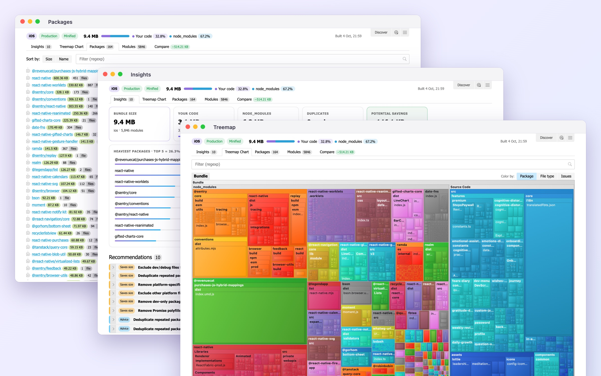

# react-native-bundle-discovery

Visualize and analyze the JS bundle of your React Native app. Find heavy packages, duplicates and deprecated
dependencies, inspect every module, and catch bundle size regressions in CI.

<picture>
  <source media="(prefers-color-scheme: dark)" srcset="./assets/overview-dark.jpg" />
  
</picture>

## Documentation

📖 **[retyui.github.io/bundle-discovery](https://retyui.github.io/bundle-discovery/)**

🚀 **[Live demo](https://retyui.github.io/bundle-discovery-demo/)**: see the UI with a real report in compare mode.

- [Quick start](https://retyui.github.io/bundle-discovery/docs/getting-started/quick-start)
- [UI](https://retyui.github.io/bundle-discovery/docs/guides/ui) and [CLI](https://retyui.github.io/bundle-discovery/docs/guides/cli)
- [Bundle size checks in CI](https://retyui.github.io/bundle-discovery/docs/guides/ci)
- [Re.Pack](https://retyui.github.io/bundle-discovery/docs/guides/repack), [Rollipop](https://retyui.github.io/bundle-discovery/docs/guides/rollipop), [rnx-kit](https://retyui.github.io/bundle-discovery/docs/guides/rnx-kit) and [React Native DevTools](https://retyui.github.io/bundle-discovery/docs/guides/rozenite)
- [API](https://retyui.github.io/bundle-discovery/docs/api/create-serializer)

## Support the project

Become a financial contributor on [OpenCollective](https://opencollective.com/react-native-bundle-discovery)
or [GitHub Sponsors](https://github.com/sponsors/retyui).

## License

MIT
