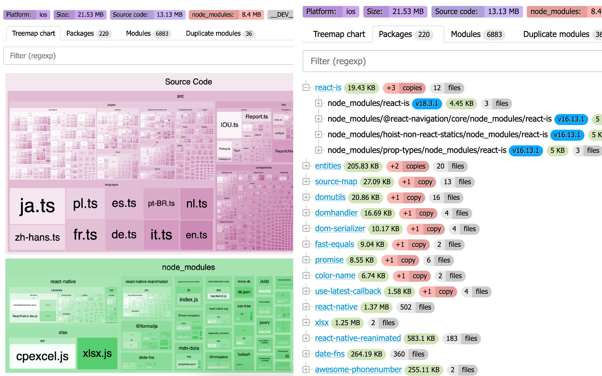

# react-native-bundle-discovery

A simple package that helps developers visualize and analyze the bundle size of React Native apps.
With this tool, you can easily explore your app's codebase, identify large or heavy packages, and inspect the structure of modules and code within your project.




### What you should consider when analyzing your bundle

1. if you use **React 19** then it's time to remove a `prop-types` package from your bundle.
2. Search for `development|debug|dev|storybook` modules in your production JS bundle (it's a dead code that should not be there).
3. Also check polyfills duplicates (search example:  `url|fetch|crypto|buffer|base-?64`).
4. Verify that you don't have any similar packages in your bundle (search example: `object|just-|debounce|ramda|lodash|underscore`). I often see that devs use both `lodash/debounce`, `lodash.debounce` and `debounce` in their projects. Or mix `ramda`, `underscore` and `lodash`._
5. Try to find `package.json$` files in your bundle. They are often used to get only the package `version/name` but all other fields are not needed in the bundle.
6. Please provide your ideas soo other devs can benefit from them :)


### Setup:

#### 1. Install

```bash
yarn add -D react-native-bundle-discovery
```

#### 2. Add to your metro.config.js

```diff
// metro.config.js
const {getDefaultConfig, mergeConfig} = require('@react-native/metro-config');
+const {createSerializer} = require('react-native-bundle-discovery');

+const mySerializer = createSerializer({
+  includeCode: true, // Useful if you want to compare source/bundle code (but a report file will be larger)
+  projectRoot: __dirname,
+   //^^^ ⚠️ WARNING: In a monorepo setup, this should point to the monorepo root,
+   //                not the individual package directory.
+});

-const config = {};
+const config = {
+  serializer: {
+    customSerializer: mySerializer
+  },
+};

module.exports = mergeConfig(getDefaultConfig(__dirname), config);
```

#### 3. Build the app

As example, for iOS you can run the following command, and it will generate the `metro-stats.json` file in the root of your project:

```bash
npx react-native bundle \
  --entry-file index.js \
  --platform ios \
  --dev false \
  --bundle-output ios/main.jsbundle \
  --assets-dest ios/assets
```

#### 4. View the report in the browser

Run webserver to view the report:

```bash
npx react-native-bundle-discovery server metro-stats.json [--port <port>]
```

#### 4. Build the HTML report

Run the following command to generate an HTML report from the JSON file:

```bash
npx react-native-bundle-discovery build metro-stats.json
```


---

### `createSerializer(optiosn: Options)`

| Prop                   | Default value             | Description                                                                                                                              |
| ---------------------- | ------------------------- | ---------------------------------------------------------------------------------------------------------------------------------------- |
| serializer: Function   | Default serializer        | A custom serializer function. If not provided, a default serializer is used.                                                             |
| projectRoot: string    | Required                  | The root directory of the project. ⚠️ In a monorepo setup, this should point to the monorepo root, not the individual package directory. |
| outputJsonPath: string | `<root>/metro-stats.json` | The path where the JSON report will be saved. Defaults to `metro-stats.json` in project root.                                            |
| includeCode: boolean   | `true`                    | Whether to include the source and output code in the JSON report.                                                                        |

### Financial Contributors

Become a financial contributor at [OpenCollective](https://opencollective.com/react-native-bundle-discovery) or [GitHub Sponsors](https://github.com/sponsors/retyui)

### Other

**Similar projects:**

- https://github.com/expo/atlas
- https://github.com/v3ron/expo-atlas-without-expo
- https://github.com/callstack/react-native-bundle-visualizer
- https://github.com/webpack-contrib/webpack-bundle-analyzer
- https://github.com/statoscope/statoscope
- https://github.com/relative-ci/bundle-stats/tree/master/packages/cli

**Built using [Discovery.js](https://github.com/discoveryjs/discovery):**

- Build blocks for pages: https://discoveryjs.github.io/discovery/#views-showcase
- Jora syntax: https://discoveryjs.github.io/jora/#article:jora-syntax-operators
