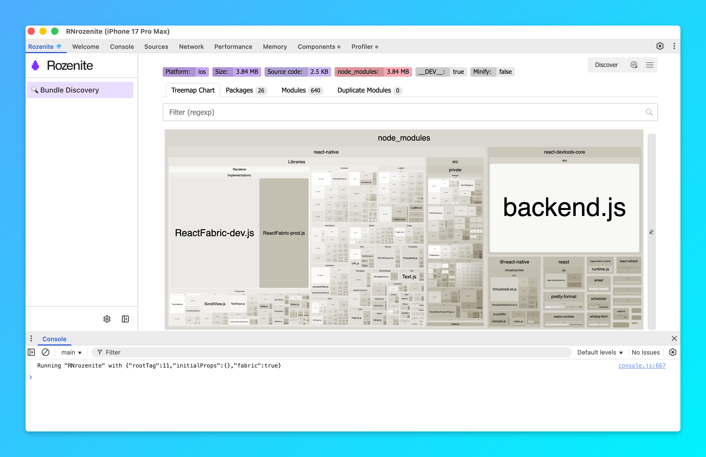

# react-native-bundle-discovery Rozenite plugin

You can use UI to discover bundles in your React Native DevTools. This plugin is built on top of [Rozenite](https://www.rozenite.dev/)




### Install

```bash
yarn dlx rozenite@latest init # init rozenite in your project (from: https://www.rozenite.dev/docs/getting-started)
yarn add -D react-native-bundle-discovery-rozenite-plugin # add the plugin to your project
```

Then in the `metro.config.js` file add the following:

```diff
const { withRozenite } = require('@rozenite/metro');
+const { withRozeniteBundleDiscoveryPlugin } = require('react-native-bundle-discovery-rozenite-plugin');
const { getDefaultConfig, mergeConfig } = require('@react-native/metro-config');

/**
 * Metro configuration
 * https://reactnative.dev/docs/metro
 *
 * @type {import('@react-native/metro-config').MetroConfig}
 */
const config = {};

module.exports = withRozenite(
  mergeConfig(getDefaultConfig(__dirname), config),
  {
+    enhanceMetroConfig: config => withRozeniteBundleDiscoveryPlugin(config, { /* Your Bundle Discovery Options */ }),
    enabled: true,
  },
);
```

Now you can run `yarn start` and open [React Native DevTools](https://reactnative.dev/docs/react-native-devtools)
